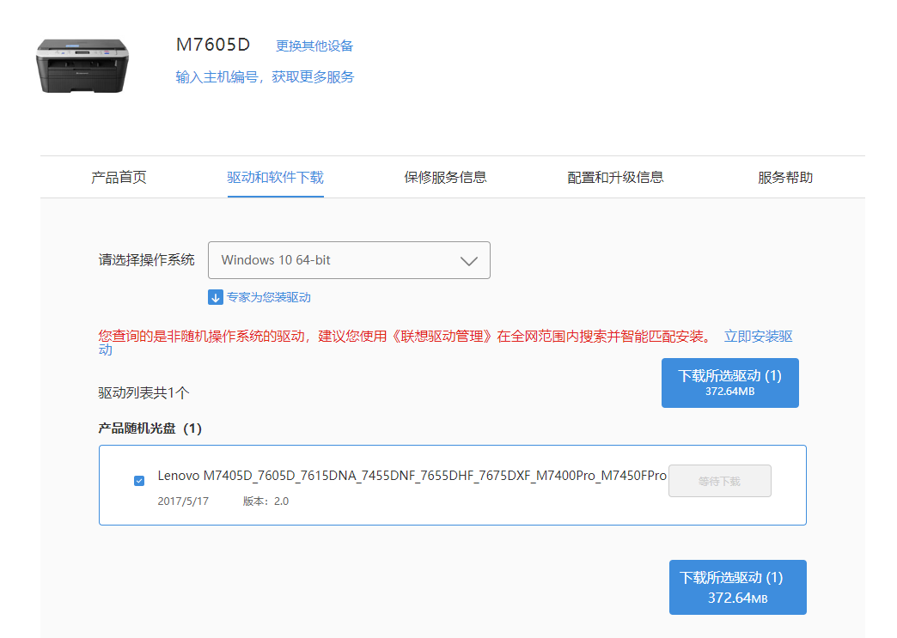

<!--more-->

プリンタを Raspberry Pi に接続する大きな利点のひとつは、たとえ有線プリンタであっても、リモート印刷を使えるようにできることです。  

Raspberry Pi をセットアップしてプリンタと接続する方法については、すでにインターネット上にたくさんの記事があります。[CUPS](https://www.cups.org/) を使った設定方法も、たとえば [*How to add a printer to your raspberry pi or other Linux Computer*](https://www.howtogeek.com/169679/how-to-add-a-printer-to-your-raspberry-pi-or-other-linux-computer/) のような記事で十分に紹介されています。なので、この部分はこの記事の主題ではありません。

この記事で扱うのは、**メーカー純正のプリンタドライバパッケージから PPD ファイルを取り出す方法**です。CUPS にそのプリンタのネイティブ対応がない場合、Linux システム（もちろん Raspberry Pi も含みます）ではこのファイルが必要になります。

具体例として、ここでは **Lenovo M7605D** を使います。

## PostScript Printer Description (PPD) ファイル

PPD ファイルは Adobe によって策定されたもので、[Wikipedia](https://en.wikipedia.org/wiki/PostScript_Printer_Description) によると、[PostScript](https://en.wikipedia.org/wiki/PostScript) プリンタが持つ機能や能力一式を記述した情報です。ざっくり言えば、ドキュメントが印刷サービスに送られたときに、プリンタがそれをどう解釈して印刷するかを定義するファイルです。

## PPD ファイルの場所を探す

Lenovo の [ドライバ配布ページ](https://newsupport.lenovo.com.cn/driveList.html?fromsource=driveList&selname=m7605d) からドライバパッケージ（ISO ファイル）をダウンロードし、展開して `/install` フォルダを開くと、多数の機種別フォルダが見つかります。



その中に進むと、`/install/M7605D/chneng/Brinst_Lang.ini` というファイルがあり、ここにその機種用の PostScript ドライバの場所が書かれています。



そのディレクトリに入ると、いくつかの `.pp_` ファイルが見つかります。これこそが欲しいものです。



## .pp_ ファイルを展開する

Lenovo が提供している `pp_` 拡張子のファイルは、実際には圧縮された ppd ファイルでした。（最初に中身を見たときは意味不明な文字列ばかりだったので暗号化されているのかと思いましたが、そうではありませんでした。）





少し検索してみると、この形式は MS-DOS の `EXPAND.EXE` で展開できると分かりました。さらに意外なことに、7-ZIP でもそのまま展開できます。



最終的に、`.ppd` ファイルを無事に取り出せました。


