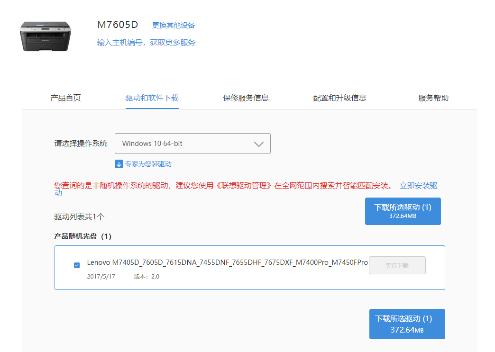

<!--more-->

最近把家里的有线打印机，通过树莓派变成了网络打印机，可以在家里不同设备上远程打印，十分方便。

关于如何用树莓派连接打印机，网上资料一搜一大堆，例如：[如何正确地用树莓派共享打印机](https://sspai.com/post/40997)，[使用树莓派搭建无线打印机](https://www.jianshu.com/p/d3752c584e01)，[*How to add a printer to your raspberry pi or other Linux Computer*](https://www.howtogeek.com/169679/how-to-add-a-printer-to-your-raspberry-pi-or-other-linux-computer/)，所以这不是这篇文章主要想讲的内容。

由于在Linux上使用CUPS安装打印机时，需要用到打印机的PPD驱动文件，而CUPS自带的驱动列表里完全没有联想的打印机，所以这篇文章主要想讲一讲**如何从联想M7605D的官方驱动中提取所需的PPD文件**，其它型号的打印机或许也可以使用这个方法。

## PPD文件

PostScript Printer Description (PPD) 文件是由Adobe公司开发的一种用来描述打印机所有支持的功能和特性的文件，它可以让系统知道如何处理和操作打印机。([Wikipedia](https://en.wikipedia.org/wiki/PostScript_Printer_Description))

## 找到驱动包中的PPD文件

从[官方驱动下载地址](https://newsupport.lenovo.com.cn/driveList.html?fromsource=driveList&selname=m7605d)下载驱动后，解压，在`/install`目录里可以看到很多不同型号的目录。



在M7605D的目录的一个文件`/install/M7605D/chneng/Brinst_Lang.ini`中可以找到包含M7605D的PPD驱动位置：



进入到目录后就可以看到后缀为`.pp_`的文件，这其实就是压缩后的`.ppd`文件



## 解压缩 .pp_文件

原先我看到这些乱码以及若隐若现的`Adobe`, `PPD`字样，以为这个文件是被联想加密了，后来发现并不是，它只是被一种比较古老的压缩算法压缩了而已





维基上说这个文件可以用MS-DOS的EXPAND命令解压，试了一下的确可以，后来又发现其实7-ZIP可以直接解压这个格式。 



最终，ppd文件就被成功提取出来了

