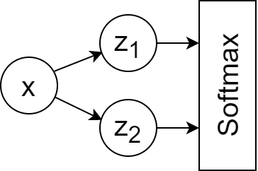

この投稿はずっと前から書きたかった。ようやく ECharts をブログの中で動かせるようになったので、きちんと形にできた。

今回の目的はシンプルだ。L1 正則化と L2 正則化を「見える」ようにすること。式だけで語るのではなく、交差エントロピー損失面が 3D 空間でどう変形するかを見ていく。そうすると、いくつかの抽象的な考え方がぐっと理解しやすくなる。特に、なぜ L1 正則化が疎なモデルを生みやすく、結果として特徴選択のように振る舞うのかが直感的に分かる。
<!--more-->

そもそも私がこの話に興味を持ったのは、L1 正則化が作る「鋭い角」について誰かが話しているのを聞いたのがきっかけだった。では、それを含めた損失面全体を直接描画したら、いったいどんな形になるのだろう。その疑問に視覚的に答えてみようとしたのがこの記事である。

## 1. 交差エントロピー損失

とても小さなニューラルネットワークを考える。


順伝播は次のように書ける。
$$\hat{z_1}=\beta_1x$$
$$\hat{z_2}=\beta_2x$$
$$Softmax(\hat{z_i}),\ i\in{2}$$

このネットワークのパラメータは $\beta_1$ と $\beta_2$ の 2 つだけである。

ここで交差エントロピー損失を考える。
$$J(\beta)=-p\log(q)-(1-p)\log(1-q)$$
$$=-p\log(\frac{e^{\beta_1x}}{e^{\beta_1x}+e^{\beta_2x}})-(1-p)\log(\frac{e^{\beta_2x}}{e^{\beta_1x}+e^{\beta_2x}})$$
$$=...$$
$$=-p\log{e^{\beta_1x}}-(1-p)log{e^{\beta_2x}}+log(e^{\beta_1x}+e^{\beta_2x})$$
$$=-p\beta_1x-(1-p)\beta_2x+log(e^{\beta_1x}+e^{\beta_2x})$$

ここで、$p$ はクラス $z_1$ に対する正解確率、$1-p$ はクラス $z_2$ に対する確率、$\beta_1$ と $\beta_2$ はモデルパラメータ、$x$ はスカラー入力である。

この式を使えば、損失面を直接可視化できる。

以下の 3D 図はすべて回転とズームが可能である。


{
  "title": {
    "text": "交差エントロピー損失の可視化",
    "left": "center"
    },
    "tooltip": {"trigger": "axis"},
    "backgroundColor": "#fff",
    "visualMap": {
        "show": false,
        "dimension": 2,
        "min": 0.5,
        "max": 5,
        "inRange": {
            "color": ["#313695", "#4575b4", "#74add1", "#abd9e9", "#e0f3f8", "#ffffbf", "#fee090", "#fdae61", "#f46d43", "#d73027", "#a50026"]
        }
    },
    "xAxis3D": {
        "max": 5,
        "min": -5,
        "type": "value",
        "name": "β1"
    },
    "yAxis3D": {
        "max": 5,
        "min": -5,
        "type": "value",
        "name": "β2"
    },
    "zAxis3D": {
        "type": "value",
        "name": "損失"
    },
    "grid3D": {
        "viewControl": {
            // "projection": "orthographic"
        }
    },
    "series": [{
        "type": "surface",
        "wireframe": {
            // "show": false
        },
        "equation": {
            "x": {
                "min": -5,
                "max": 5, 
                "step": 0.1
            },
            "y": {
                "min": -5,
                "max": 5,
                "step": 0.1
            },
            "z": function (b1, b2) {
                ptrue = 1;
                x = 1;
                l1a = 0;
                l2a = 0;
                <!-- return (ptrue*Math.exp(b2*x)-(1-ptrue)*Math.exp(b1*x))/(Math.exp(b1*x)+Math.exp(b2*x))+l1a*(Math.abs(b1)+Math.abs(b2))+l2a*(b1**2+b2**2); -->
                return -ptrue*b1*x-(1-ptrue)*b2*x+Math.log(Math.exp(b1*x)+Math.exp(b2*x))+l1a*(Math.abs(b1)+Math.abs(b2))+l2a*(b1**2+b2**2);
            }
        }
    }]
}


ここでは単純化のため、$p$ も $x$ も 1 に固定している。ポイントは $\beta_1$ と $\beta_2$ が動いたときに損失がどう変わるかを見ることだからだ。

この面は滑らかである。そして最小値は、$\beta_1 \to +\infty$、$\beta_2 \to -\infty$ の方向へどこまでも流れていく。直感的には、正則化がなければ、勾配ベースの最適化はクラス分離が良くなる限り、より大きなパラメータをどんどん報酬づけしてしまう。これが、過学習が問題になる理由のひとつでもある。

## 2. L1 正則化を加えた交差エントロピー損失

パラメータの絶対値が大きくなりすぎるのを防ぐために、正則化項を加えることができる。

L1 正則化を加えると、損失は次のようになる。

$$J(\beta)=-p\beta_1x-(1-p)\beta_2x+log(e^{\beta_1x}+e^{\beta_2x})+\lambda{(||\beta_1||_1+||\beta_2||_1)}$$

ここで $\lambda$ は L1 正則化の強さである。

以下の図は、$\lambda$ の値を変えたときに損失面の形がどう変わるかを示している。


{
  "title": {
    "text": "L1 正則化付き交差エントロピー損失\n(λ=0.2)",
    "left": "center"
    },
    "tooltip": {"trigger": "axis"},
    "backgroundColor": "#fff",
    "visualMap": {
        "show": false,
        "dimension": 2,
        "min": 0.5,
        "max": 5,
        "inRange": {
            "color": ["#313695", "#4575b4", "#74add1", "#abd9e9", "#e0f3f8", "#ffffbf", "#fee090", "#fdae61", "#f46d43", "#d73027", "#a50026"]
        }
    },
    "xAxis3D": {
        "max": 5,
        "min": -5,
        "type": "value",
        "name": "β1"
    },
    "yAxis3D": {
        "max": 5,
        "min": -5,
        "type": "value",
        "name": "β2"
    },
    "zAxis3D": {
        "type": "value",
        "name": "損失"
    },
    "grid3D": {
        "viewControl": {
            // "projection": "orthographic"
        }
    },
    "series": [{
        "type": "surface",
        "wireframe": {
            // "show": false
        },
        "equation": {
            "x": {
                "min": -5,
                "max": 5, 
                "step": 0.1
            },
            "y": {
                "min": -5,
                "max": 5,
                "step": 0.1
            },
            "z": function (b1, b2) {
                ptrue = 1;
                x = 1;
                l1a = 0.2;
                l2a = 0;
                <!-- return (ptrue*Math.exp(b2*x)-(1-ptrue)*Math.exp(b1*x))/(Math.exp(b1*x)+Math.exp(b2*x))+l1a*(Math.abs(b1)+Math.abs(b2))+l2a*(b1**2+b2**2); -->
                return -ptrue*b1*x-(1-ptrue)*b2*x+Math.log(Math.exp(b1*x)+Math.exp(b2*x))+l1a*(Math.abs(b1)+Math.abs(b2))+l2a*(b1**2+b2**2);
            }
        }
    }]
}



{
  "title": {
    "text": "L1 正則化付き交差エントロピー損失\n(λ=0.4)",
    "left": "center"
    },
    "tooltip": {"trigger": "axis"},
    "backgroundColor": "#fff",
    "visualMap": {
        "show": false,
        "dimension": 2,
        "min": 0.5,
        "max": 5,
        "inRange": {
            "color": ["#313695", "#4575b4", "#74add1", "#abd9e9", "#e0f3f8", "#ffffbf", "#fee090", "#fdae61", "#f46d43", "#d73027", "#a50026"]
        }
    },
    "xAxis3D": {
        "max": 5,
        "min": -5,
        "type": "value",
        "name": "β1"
    },
    "yAxis3D": {
        "max": 5,
        "min": -5,
        "type": "value",
        "name": "β2"
    },
    "zAxis3D": {
        "type": "value",
        "name": "損失"
    },
    "grid3D": {
        "viewControl": {
            // "projection": "orthographic"
        }
    },
    "series": [{
        "type": "surface",
        "wireframe": {
            // "show": false
        },
        "equation": {
            "x": {
                "min": -5,
                "max": 5, 
                "step": 0.1
            },
            "y": {
                "min": -5,
                "max": 5,
                "step": 0.1
            },
            "z": function (b1, b2) {
                ptrue = 1;
                x = 1;
                l1a = 0.4;
                l2a = 0;
                <!-- return (ptrue*Math.exp(b2*x)-(1-ptrue)*Math.exp(b1*x))/(Math.exp(b1*x)+Math.exp(b2*x))+l1a*(Math.abs(b1)+Math.abs(b2))+l2a*(b1**2+b2**2); -->
                return -ptrue*b1*x-(1-ptrue)*b2*x+Math.log(Math.exp(b1*x)+Math.exp(b2*x))+l1a*(Math.abs(b1)+Math.abs(b2))+l2a*(b1**2+b2**2);
            }
        }
    }]
}



{
  "title": {
    "text": "L1 正則化付き交差エントロピー損失\n(λ=0.6)",
    "left": "center"
    },
    "tooltip": {"trigger": "axis"},
    "backgroundColor": "#fff",
    "visualMap": {
        "show": false,
        "dimension": 2,
        "min": 0.5,
        "max": 5,
        "inRange": {
            "color": ["#313695", "#4575b4", "#74add1", "#abd9e9", "#e0f3f8", "#ffffbf", "#fee090", "#fdae61", "#f46d43", "#d73027", "#a50026"]
        }
    },
    "xAxis3D": {
        "max": 5,
        "min": -5,
        "type": "value",
        "name": "β1"
    },
    "yAxis3D": {
        "max": 5,
        "min": -5,
        "type": "value",
        "name": "β2"
    },
    "zAxis3D": {
        "type": "value",
        "name": "損失"
    },
    "grid3D": {
        "viewControl": {
            // "projection": "orthographic"
        }
    },
    "series": [{
        "type": "surface",
        "wireframe": {
            // "show": false
        },
        "equation": {
            "x": {
                "min": -5,
                "max": 5, 
                "step": 0.1
            },
            "y": {
                "min": -5,
                "max": 5,
                "step": 0.1
            },
            "z": function (b1, b2) {
                ptrue = 1;
                x = 1;
                l1a = 0.6;
                l2a = 0;
                <!-- return (ptrue*Math.exp(b2*x)-(1-ptrue)*Math.exp(b1*x))/(Math.exp(b1*x)+Math.exp(b2*x))+l1a*(Math.abs(b1)+Math.abs(b2))+l2a*(b1**2+b2**2); -->
                return -ptrue*b1*x-(1-ptrue)*b2*x+Math.log(Math.exp(b1*x)+Math.exp(b2*x))+l1a*(Math.abs(b1)+Math.abs(b2))+l2a*(b1**2+b2**2);
            }
        }
    }]
}



{
  "title": {
    "text": "L1 正則化付き交差エントロピー損失\n(λ=0.8)",
    "left": "center"
    },
    "tooltip": {"trigger": "axis"},
    "backgroundColor": "#fff",
    "visualMap": {
        "show": false,
        "dimension": 2,
        "min": 0.5,
        "max": 5,
        "inRange": {
            "color": ["#313695", "#4575b4", "#74add1", "#abd9e9", "#e0f3f8", "#ffffbf", "#fee090", "#fdae61", "#f46d43", "#d73027", "#a50026"]
        }
    },
    "xAxis3D": {
        "max": 5,
        "min": -5,
        "type": "value",
        "name": "β1"
    },
    "yAxis3D": {
        "max": 5,
        "min": -5,
        "type": "value",
        "name": "β2"
    },
    "zAxis3D": {
        "type": "value",
        "name": "損失"
    },
    "grid3D": {
        "viewControl": {
            // "projection": "orthographic"
        }
    },
    "series": [{
        "type": "surface",
        "wireframe": {
            // "show": false
        },
        "equation": {
            "x": {
                "min": -5,
                "max": 5, 
                "step": 0.1
            },
            "y": {
                "min": -5,
                "max": 5,
                "step": 0.1
            },
            "z": function (b1, b2) {
                ptrue = 1;
                x = 1;
                l1a = 0.8;
                l2a = 0;
                <!-- return (ptrue*Math.exp(b2*x)-(1-ptrue)*Math.exp(b1*x))/(Math.exp(b1*x)+Math.exp(b2*x))+l1a*(Math.abs(b1)+Math.abs(b2))+l2a*(b1**2+b2**2); -->
                return -ptrue*b1*x-(1-ptrue)*b2*x+Math.log(Math.exp(b1*x)+Math.exp(b2*x))+l1a*(Math.abs(b1)+Math.abs(b2))+l2a*(b1**2+b2**2);
            }
        }
    }]
}


最初にこれらの図を見たときの私の感想は、「美しい」と同時に「驚くほど分かりやすい」だった。抽象的な最適化の話が、3D 曲面になるだけで直接観察できるものになる。

視覚的にもっとも重要な変化は、L1 正則化が損失面に **折れ目** を生み出し、$\lambda$ が大きくなるほどその折れ目が鋭くなることだ。

さらに重要なのは、その折れ目がちょうど $\beta_1=0$ と $\beta_2=0$ の直線上に現れることである。つまり、最適化がちょうどゼロのパラメータ値に着地しやすくなる。これこそが、L1 正則化が疎なモデルを生みやすい幾何学的な理由である。


TensorFlow では、微分不可能な点における勾配は通常 0 に設定される。

Reference: https://stackoverflow.com/a/41520694

以下のコードは、区分的に定義された関数で $x=0$ における導関数を確かめる例である。
```python
import tensorflow as tf
x = tf.Variable(0.0)
y = tf.where(tf.greater(x, 0), x+2, 2)  # Piecewise function: y=2 (x<0), y=x+2 (x>=0)
grad = tf.gradients(y, [x])[0]
with tf.Session() as sess:
    sess.run(tf.global_variables_initializer())
    print(sess.run(grad))
```



L1 正則化は微分不可能な点を作るため、勾配降下法の代わりに座標降下法が使われることがある。

座標降下法は全勾配を一度にたどるのではなく、1 座標ずつ更新していく。そのため、こうした鋭い角が引き起こす問題の一部を避けやすい。

See: https://en.wikipedia.org/wiki/Coordinate_descent


## 3. L2 正則化を加えた交差エントロピー損失

次に L2 正則化を加えてみる。

$$J(\beta)=-p\beta_1x-(1-p)\beta_2x+log(e^{\beta_1x}+e^{\beta_2x})+\Omega{(||\beta_1||_2^2+||\beta_2||_2^2)}$$

以下の図は、L2 係数 $\Omega$ を変えたときの損失面を示している。


{
  "title": {
    "text": "L2 正則化付き交差エントロピー損失\n(Ω=0.1)",
    "left": "center"
    },
    "tooltip": {"trigger": "axis"},
    "backgroundColor": "#fff",
    "visualMap": {
        "show": false,
        "dimension": 2,
        "min": 0.5,
        "max": 5,
        "inRange": {
            "color": ["#313695", "#4575b4", "#74add1", "#abd9e9", "#e0f3f8", "#ffffbf", "#fee090", "#fdae61", "#f46d43", "#d73027", "#a50026"]
        }
    },
    "xAxis3D": {
        "max": 5,
        "min": -5,
        "type": "value",
        "name": "β1"
    },
    "yAxis3D": {
        "max": 5,
        "min": -5,
        "type": "value",
        "name": "β2"
    },
    "zAxis3D": {
        "type": "value",
        "name": "損失"
    },
    "grid3D": {
        "viewControl": {
            // "projection": "orthographic"
        }
    },
    "series": [{
        "type": "surface",
        "wireframe": {
            // "show": false
        },
        "equation": {
            "x": {
                "min": -5,
                "max": 5, 
                "step": 0.1
            },
            "y": {
                "min": -5,
                "max": 5,
                "step": 0.1
            },
            "z": function (b1, b2) {
                ptrue = 1;
                x = 1;
                l1a = 0;
                l2a = 0.1;
                <!-- return (ptrue*Math.exp(b2*x)-(1-ptrue)*Math.exp(b1*x))/(Math.exp(b1*x)+Math.exp(b2*x))+l1a*(Math.abs(b1)+Math.abs(b2))+l2a*(b1**2+b2**2); -->
                return -ptrue*b1*x-(1-ptrue)*b2*x+Math.log(Math.exp(b1*x)+Math.exp(b2*x))+l1a*(Math.abs(b1)+Math.abs(b2))+l2a*(b1**2+b2**2);
            }
        }
    }]
}



{
  "title": {
    "text": "L2 正則化付き交差エントロピー損失\n(Ω=0.2)",
    "left": "center"
    },
    "tooltip": {"trigger": "axis"},
    "backgroundColor": "#fff",
    "visualMap": {
        "show": false,
        "dimension": 2,
        "min": 0.5,
        "max": 5,
        "inRange": {
            "color": ["#313695", "#4575b4", "#74add1", "#abd9e9", "#e0f3f8", "#ffffbf", "#fee090", "#fdae61", "#f46d43", "#d73027", "#a50026"]
        }
    },
    "xAxis3D": {
        "max": 5,
        "min": -5,
        "type": "value",
        "name": "β1"
    },
    "yAxis3D": {
        "max": 5,
        "min": -5,
        "type": "value",
        "name": "β2"
    },
    "zAxis3D": {
        "type": "value",
        "name": "損失"
    },
    "grid3D": {
        "viewControl": {
            // "projection": "orthographic"
        }
    },
    "series": [{
        "type": "surface",
        "wireframe": {
            // "show": false
        },
        "equation": {
            "x": {
                "min": -5,
                "max": 5, 
                "step": 0.1
            },
            "y": {
                "min": -5,
                "max": 5,
                "step": 0.1
            },
            "z": function (b1, b2) {
                ptrue = 1;
                x = 1;
                l1a = 0;
                l2a = 0.2;
                <!-- return (ptrue*Math.exp(b2*x)-(1-ptrue)*Math.exp(b1*x))/(Math.exp(b1*x)+Math.exp(b2*x))+l1a*(Math.abs(b1)+Math.abs(b2))+l2a*(b1**2+b2**2); -->
                return -ptrue*b1*x-(1-ptrue)*b2*x+Math.log(Math.exp(b1*x)+Math.exp(b2*x))+l1a*(Math.abs(b1)+Math.abs(b2))+l2a*(b1**2+b2**2);
            }
        }
    }]
}



{
  "title": {
    "text": "L2 正則化付き交差エントロピー損失\n(Ω=0.3)",
    "left": "center"
    },
    "tooltip": {"trigger": "axis"},
    "backgroundColor": "#fff",
    "visualMap": {
        "show": false,
        "dimension": 2,
        "min": 0.5,
        "max": 5,
        "inRange": {
            "color": ["#313695", "#4575b4", "#74add1", "#abd9e9", "#e0f3f8", "#ffffbf", "#fee090", "#fdae61", "#f46d43", "#d73027", "#a50026"]
        }
    },
    "xAxis3D": {
        "max": 5,
        "min": -5,
        "type": "value",
        "name": "β1"
    },
    "yAxis3D": {
        "max": 5,
        "min": -5,
        "type": "value",
        "name": "β2"
    },
    "zAxis3D": {
        "type": "value",
        "name": "損失"
    },
    "grid3D": {
        "viewControl": {
            // "projection": "orthographic"
        }
    },
    "series": [{
        "type": "surface",
        "wireframe": {
            // "show": false
        },
        "equation": {
            "x": {
                "min": -5,
                "max": 5, 
                "step": 0.1
            },
            "y": {
                "min": -5,
                "max": 5,
                "step": 0.1
            },
            "z": function (b1, b2) {
                ptrue = 1;
                x = 1;
                l1a = 0;
                l2a = 0.3;
                <!-- return (ptrue*Math.exp(b2*x)-(1-ptrue)*Math.exp(b1*x))/(Math.exp(b1*x)+Math.exp(b2*x))+l1a*(Math.abs(b1)+Math.abs(b2))+l2a*(b1**2+b2**2); -->
                return -ptrue*b1*x-(1-ptrue)*b2*x+Math.log(Math.exp(b1*x)+Math.exp(b2*x))+l1a*(Math.abs(b1)+Math.abs(b2))+l2a*(b1**2+b2**2);
            }
        }
    }]
}



{
  "title": {
    "text": "L2 正則化付き交差エントロピー損失\n(Ω=0.4)",
    "left": "center"
    },
    "tooltip": {"trigger": "axis"},
    "backgroundColor": "#fff",
    "visualMap": {
        "show": false,
        "dimension": 2,
        "min": 0.5,
        "max": 5,
        "inRange": {
            "color": ["#313695", "#4575b4", "#74add1", "#abd9e9", "#e0f3f8", "#ffffbf", "#fee090", "#fdae61", "#f46d43", "#d73027", "#a50026"]
        }
    },
    "xAxis3D": {
        "max": 5,
        "min": -5,
        "type": "value",
        "name": "β1"
    },
    "yAxis3D": {
        "max": 5,
        "min": -5,
        "type": "value",
        "name": "β2"
    },
    "zAxis3D": {
        "type": "value",
        "name": "損失"
    },
    "grid3D": {
        "viewControl": {
            // "projection": "orthographic"
        }
    },
    "series": [{
        "type": "surface",
        "wireframe": {
            // "show": false
        },
        "equation": {
            "x": {
                "min": -5,
                "max": 5, 
                "step": 0.1
            },
            "y": {
                "min": -5,
                "max": 5,
                "step": 0.1
            },
            "z": function (b1, b2) {
                ptrue = 1;
                x = 1;
                l1a = 0;
                l2a = 0.4;
                <!-- return (ptrue*Math.exp(b2*x)-(1-ptrue)*Math.exp(b1*x))/(Math.exp(b1*x)+Math.exp(b2*x))+l1a*(Math.abs(b1)+Math.abs(b2))+l2a*(b1**2+b2**2); -->
                return -ptrue*b1*x-(1-ptrue)*b2*x+Math.log(Math.exp(b1*x)+Math.exp(b2*x))+l1a*(Math.abs(b1)+Math.abs(b2))+l2a*(b1**2+b2**2);
            }
        }
    }]
}


L2 正則化は、損失面をまったく別の形で変化させる。折れ目を作るのではなく、曲面全体を滑らかに曲げる。最小値はもはや $\beta_1 \to +\infty$、$\beta_2 \to -\infty$ の方向へ押し流されるのではなく、有限の位置へ移動する。そして L2 係数が大きくなるほど、その最小値は原点 $(0, 0)$ に近づいていく。

## 4. L1 と L2 の両方を加えた交差エントロピー損失

もちろん、L1 と L2 は同時に使うこともできる。


{
  "title": {
    "text": "L1+L2 正則化付き交差エントロピー損失\n(λ=0.1，Ω=0.4)",
    "left": "center"
    },
    "tooltip": {"trigger": "axis"},
    "backgroundColor": "#fff",
    "visualMap": {
        "show": false,
        "dimension": 2,
        "min": 0.5,
        "max": 5,
        "inRange": {
            "color": ["#313695", "#4575b4", "#74add1", "#abd9e9", "#e0f3f8", "#ffffbf", "#fee090", "#fdae61", "#f46d43", "#d73027", "#a50026"]
        }
    },
    "xAxis3D": {
        "max": 5,
        "min": -5,
        "type": "value",
        "name": "β1"
    },
    "yAxis3D": {
        "max": 5,
        "min": -5,
        "type": "value",
        "name": "β2"
    },
    "zAxis3D": {
        "type": "value",
        "name": "損失"
    },
    "grid3D": {
        "viewControl": {
            // "projection": "orthographic"
        }
    },
    "series": [{
        "type": "surface",
        "wireframe": {
            // "show": false
        },
        "equation": {
            "x": {
                "min": -5,
                "max": 5, 
                "step": 0.1
            },
            "y": {
                "min": -5,
                "max": 5,
                "step": 0.1
            },
            "z": function (b1, b2) {
                ptrue = 1;
                x = 1;
                l1a = 0.4;
                l2a = 0.1;
                <!-- return (ptrue*Math.exp(b2*x)-(1-ptrue)*Math.exp(b1*x))/(Math.exp(b1*x)+Math.exp(b2*x))+l1a*(Math.abs(b1)+Math.abs(b2))+l2a*(b1**2+b2**2); -->
                return -ptrue*b1*x-(1-ptrue)*b2*x+Math.log(Math.exp(b1*x)+Math.exp(b2*x))+l1a*(Math.abs(b1)+Math.abs(b2))+l2a*(b1**2+b2**2);
            }
        }
    }]
}


この複合的な損失面は、両方の性質を受け継ぐ。L2 による滑らかな引き寄せと、L1 が導入する軸に沿った折れ目の両方が現れる。

## 5. まとめ

L1 正則化:
- パラメータ絶対値の総和にペナルティを与えるため、疎性を促しやすい
- 一部のパラメータをちょうど 0 まで押し込むため、しばしば特徴選択のように振る舞う
- より単純で解釈しやすいモデルを作りやすいが、そのぶん非常に複雑な関係を捉えにくくなることもある
- 外れ値に対して比較的頑健である

L2 正則化:
- パラメータ二乗和にペナルティを与えるため、小さな値へは押し縮めるが、通常は 0 にはなりにくい
- 疎なモデルではなく密なモデルを生みやすい
- 特徴全体の情報を残しやすく、予測性能が良くなることが多い
- L1 と比べると外れ値には敏感である

さらに読みたい人向け:

What does regularization mean in machine learning? (Chinese)
https://zhuanlan.zhihu.com/p/62615141
