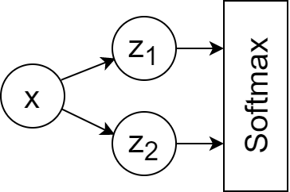

这篇文章想写很久了，最近终于解决了在博客中插入Echarts的问题，于是终于把它写完了。这篇文章主要是尝试对L1和L2正则化做了可视化，使用交叉熵损失函数使用基础损失函数。由于在其它地方也没有看到过类似的东西，所以觉得写一篇出来还是有点意义的。
3D可视化的图像可以帮助对损失函数，正则化的理解。并且也能直观地解释一些问题，比如为什么L1正则化会导致稀疏模型，会产生特征选择的效果。
<!--more-->

正则化的概念了解很久了，但是第一次觉得正则化中的某些东西会成为一个问题，还是看到了[小熊猫的B站视频里关于尖点的描述](https://www.bilibili.com/video/BV1fE411g7Ru?share_source=copy_web)(在24:20)。于是我产生了好奇，如果把带正则化项的损失函数可视化出来，会是什么样的呢？于是就有了这篇文章。

## 1. 交叉熵损失
考虑一个简单的神经网络:

这个网络的前向计算公式为:
$$\hat{z_1}=\beta_1x$$
$$\hat{z_2}=\beta_2x$$
$$Softmax(\hat{z_i}),\ i\in{2}$$
这个网络只有两个参数$\beta_1$和$\beta_2$，
考虑使用交叉熵损失函数: 
$$J(\beta)=-p\log(q)-(1-p)\log(1-q)$$
$$=-p\log(\frac{e^{\beta_1x}}{e^{\beta_1x}+e^{\beta_2x}})-(1-p)\log(\frac{e^{\beta_2x}}{e^{\beta_1x}+e^{\beta_2x}})$$
$$=...$$
$$=-p\log{e^{\beta_1x}}-(1-p)log{e^{\beta_2x}}+log(e^{\beta_1x}+e^{\beta_2x})$$
$$=-p\beta_1x-(1-p)\beta_2x+log(e^{\beta_1x}+e^{\beta_2x})$$
这里，$p$代表真实值，$z_1$ 和 $1-p$ 代表 $z_2$ 的真实标签, $\beta_1$ 和 $\beta_2$ 是模型参数, $x$ 代表模型输入，是一个标量（只有一个x）.

然后，根据此公式，交叉熵损失函数就可以被可视化为：

{
  "title": {
    "text": "Cross Entropy Loss Visualized",
    "left": "center"
    },
    "tooltip": {"trigger": "axis"},
    "backgroundColor": "#fff",
    "visualMap": {
        "show": false,
        "dimension": 2,
        "min": 0.5,
        "max": 5,
        "inRange": {
            "color": ["#313695", "#4575b4", "#74add1", "#abd9e9", "#e0f3f8", "#ffffbf", "#fee090", "#fdae61", "#f46d43", "#d73027", "#a50026"]
        }
    },
    "xAxis3D": {
        "max": 5,
        "min": -5,
        "type": "value",
        "name": "β1"
    },
    "yAxis3D": {
        "max": 5,
        "min": -5,
        "type": "value",
        "name": "β2"
    },
    "zAxis3D": {
        "type": "value",
        "name": "Loss"
    },
    "grid3D": {
        "viewControl": {
            // "projection": "orthographic"
        }
    },
    "series": [{
        "type": "surface",
        "wireframe": {
            // "show": false
        },
        "equation": {
            "x": {
                "min": -5,
                "max": 5, 
                "step": 0.1
            },
            "y": {
                "min": -5,
                "max": 5,
                "step": 0.1
            },
            "z": function (b1, b2) {
                ptrue = 1;
                x = 1;
                l1a = 0;
                l2a = 0;
                <!-- return (ptrue*Math.exp(b2*x)-(1-ptrue)*Math.exp(b1*x))/(Math.exp(b1*x)+Math.exp(b2*x))+l1a*(Math.abs(b1)+Math.abs(b2))+l2a*(b1**2+b2**2); -->
                return -ptrue*b1*x-(1-ptrue)*b2*x+Math.log(Math.exp(b1*x)+Math.exp(b2*x))+l1a*(Math.abs(b1)+Math.abs(b2))+l2a*(b1**2+b2**2);
            }
        }
    }]
}

(为了方便，p和x都被设定为了1，因为我们目前只关心损失是如何根据模型参数$\beta_1$和$\beta_2$变化的)

在上面的图中我们可以看到一个平滑的曲面，这个曲面在$\beta_1$趋近于正无穷，$\beta_2$趋近于负无穷时取得最小值。可以大致理解为，如果没有正则化项，那么梯度下降法会尽可能让$\beta_1$和$\beta_2$变得非常大(小)，以此可能会更容易得到一个过拟合的模型。

## 2. 带L1正则化的交叉熵损失
为了避免参数值过大（过小），也就是避免过拟合，我们可以使用正则化。

L1正则化是在损失函数上加入参数的一阶范数之和：

$$J(\beta)=-p\beta_1x-(1-p)\beta_2x+log(e^{\beta_1x}+e^{\beta_2x})+\lambda{(||\beta_1||_1+||\beta_2||_1)}$$
其中$\lambda$为L1正则化系数。

下面的图展示了在不同L1正则化系数的情况下，对损失函数图像的影响：


{
  "title": {
    "text": "Cross Entropy Loss Visualized with L1 Reg\n(λ=0.2)",
    "left": "center"
    },
    "tooltip": {"trigger": "axis"},
    "backgroundColor": "#fff",
    "visualMap": {
        "show": false,
        "dimension": 2,
        "min": 0.5,
        "max": 5,
        "inRange": {
            "color": ["#313695", "#4575b4", "#74add1", "#abd9e9", "#e0f3f8", "#ffffbf", "#fee090", "#fdae61", "#f46d43", "#d73027", "#a50026"]
        }
    },
    "xAxis3D": {
        "max": 5,
        "min": -5,
        "type": "value",
        "name": "β1"
    },
    "yAxis3D": {
        "max": 5,
        "min": -5,
        "type": "value",
        "name": "β2"
    },
    "zAxis3D": {
        "type": "value",
        "name": "Loss"
    },
    "grid3D": {
        "viewControl": {
            // "projection": "orthographic"
        }
    },
    "series": [{
        "type": "surface",
        "wireframe": {
            // "show": false
        },
        "equation": {
            "x": {
                "min": -5,
                "max": 5, 
                "step": 0.1
            },
            "y": {
                "min": -5,
                "max": 5,
                "step": 0.1
            },
            "z": function (b1, b2) {
                ptrue = 1;
                x = 1;
                l1a = 0.2;
                l2a = 0;
                <!-- return (ptrue*Math.exp(b2*x)-(1-ptrue)*Math.exp(b1*x))/(Math.exp(b1*x)+Math.exp(b2*x))+l1a*(Math.abs(b1)+Math.abs(b2))+l2a*(b1**2+b2**2); -->
                return -ptrue*b1*x-(1-ptrue)*b2*x+Math.log(Math.exp(b1*x)+Math.exp(b2*x))+l1a*(Math.abs(b1)+Math.abs(b2))+l2a*(b1**2+b2**2);
            }
        }
    }]
}



{
  "title": {
    "text": "Cross Entropy Loss Visualized with L1 Reg\n(λ=0.4)",
    "left": "center"
    },
    "tooltip": {"trigger": "axis"},
    "backgroundColor": "#fff",
    "visualMap": {
        "show": false,
        "dimension": 2,
        "min": 0.5,
        "max": 5,
        "inRange": {
            "color": ["#313695", "#4575b4", "#74add1", "#abd9e9", "#e0f3f8", "#ffffbf", "#fee090", "#fdae61", "#f46d43", "#d73027", "#a50026"]
        }
    },
    "xAxis3D": {
        "max": 5,
        "min": -5,
        "type": "value",
        "name": "β1"
    },
    "yAxis3D": {
        "max": 5,
        "min": -5,
        "type": "value",
        "name": "β2"
    },
    "zAxis3D": {
        "type": "value",
        "name": "Loss"
    },
    "grid3D": {
        "viewControl": {
            // "projection": "orthographic"
        }
    },
    "series": [{
        "type": "surface",
        "wireframe": {
            // "show": false
        },
        "equation": {
            "x": {
                "min": -5,
                "max": 5, 
                "step": 0.1
            },
            "y": {
                "min": -5,
                "max": 5,
                "step": 0.1
            },
            "z": function (b1, b2) {
                ptrue = 1;
                x = 1;
                l1a = 0.4;
                l2a = 0;
                <!-- return (ptrue*Math.exp(b2*x)-(1-ptrue)*Math.exp(b1*x))/(Math.exp(b1*x)+Math.exp(b2*x))+l1a*(Math.abs(b1)+Math.abs(b2))+l2a*(b1**2+b2**2); -->
                return -ptrue*b1*x-(1-ptrue)*b2*x+Math.log(Math.exp(b1*x)+Math.exp(b2*x))+l1a*(Math.abs(b1)+Math.abs(b2))+l2a*(b1**2+b2**2);
            }
        }
    }]
}



{
  "title": {
    "text": "Cross Entropy Loss Visualized with L1 Reg\n(λ=0.6)",
    "left": "center"
    },
    "tooltip": {"trigger": "axis"},
    "backgroundColor": "#fff",
    "visualMap": {
        "show": false,
        "dimension": 2,
        "min": 0.5,
        "max": 5,
        "inRange": {
            "color": ["#313695", "#4575b4", "#74add1", "#abd9e9", "#e0f3f8", "#ffffbf", "#fee090", "#fdae61", "#f46d43", "#d73027", "#a50026"]
        }
    },
    "xAxis3D": {
        "max": 5,
        "min": -5,
        "type": "value",
        "name": "β1"
    },
    "yAxis3D": {
        "max": 5,
        "min": -5,
        "type": "value",
        "name": "β2"
    },
    "zAxis3D": {
        "type": "value",
        "name": "Loss"
    },
    "grid3D": {
        "viewControl": {
            // "projection": "orthographic"
        }
    },
    "series": [{
        "type": "surface",
        "wireframe": {
            // "show": false
        },
        "equation": {
            "x": {
                "min": -5,
                "max": 5, 
                "step": 0.1
            },
            "y": {
                "min": -5,
                "max": 5,
                "step": 0.1
            },
            "z": function (b1, b2) {
                ptrue = 1;
                x = 1;
                l1a = 0.6;
                l2a = 0;
                <!-- return (ptrue*Math.exp(b2*x)-(1-ptrue)*Math.exp(b1*x))/(Math.exp(b1*x)+Math.exp(b2*x))+l1a*(Math.abs(b1)+Math.abs(b2))+l2a*(b1**2+b2**2); -->
                return -ptrue*b1*x-(1-ptrue)*b2*x+Math.log(Math.exp(b1*x)+Math.exp(b2*x))+l1a*(Math.abs(b1)+Math.abs(b2))+l2a*(b1**2+b2**2);
            }
        }
    }]
}



{
  "title": {
    "text": "Cross Entropy Loss Visualized with L1 Reg\n(λ=0.8)",
    "left": "center"
    },
    "tooltip": {"trigger": "axis"},
    "backgroundColor": "#fff",
    "visualMap": {
        "show": false,
        "dimension": 2,
        "min": 0.5,
        "max": 5,
        "inRange": {
            "color": ["#313695", "#4575b4", "#74add1", "#abd9e9", "#e0f3f8", "#ffffbf", "#fee090", "#fdae61", "#f46d43", "#d73027", "#a50026"]
        }
    },
    "xAxis3D": {
        "max": 5,
        "min": -5,
        "type": "value",
        "name": "β1"
    },
    "yAxis3D": {
        "max": 5,
        "min": -5,
        "type": "value",
        "name": "β2"
    },
    "zAxis3D": {
        "type": "value",
        "name": "Loss"
    },
    "grid3D": {
        "viewControl": {
            // "projection": "orthographic"
        }
    },
    "series": [{
        "type": "surface",
        "wireframe": {
            // "show": false
        },
        "equation": {
            "x": {
                "min": -5,
                "max": 5, 
                "step": 0.1
            },
            "y": {
                "min": -5,
                "max": 5,
                "step": 0.1
            },
            "z": function (b1, b2) {
                ptrue = 1;
                x = 1;
                l1a = 0.8;
                l2a = 0;
                <!-- return (ptrue*Math.exp(b2*x)-(1-ptrue)*Math.exp(b1*x))/(Math.exp(b1*x)+Math.exp(b2*x))+l1a*(Math.abs(b1)+Math.abs(b2))+l2a*(b1**2+b2**2); -->
                return -ptrue*b1*x-(1-ptrue)*b2*x+Math.log(Math.exp(b1*x)+Math.exp(b2*x))+l1a*(Math.abs(b1)+Math.abs(b2))+l2a*(b1**2+b2**2);
            }
        }
    }]
}

不知道你们看到这些图的第一反应是什么，我个人还是觉得比较震撼的，一方面是很美，另一方面3D图一下子把一个抽象的东西变得直观了起来。

可以看到L1正则化使损失函数曲面产生了**折叠**，并且不同$\lambda$值对于损失函数曲面的折叠程度是不同的。

另外注意到，折叠槽正巧就位于$\beta_1=0$和$\beta_2=0$两个位置，也就是坐标轴上。这就使得模型更容易到达$\beta_1$或$\beta_2$为0的地方。并且，**这就是L1正则化会导致稀疏模型的原因！**


在Tensorflow中，不可导的点的导数会直接被设为0

见 https://stackoverflow.com/a/41520694

下面这段代码可以测试在不同的分段函数情况下，x=0点的导数值：
```python
import tensorflow as tf
x = tf.Variable(0.0)
y = tf.where(tf.greater(x, 0), x+2, 2)  # 这里的分段函数为：y=2 (x<0), y=x+2 (x>=0)
grad = tf.gradients(y, [x])[0]
with tf.Session() as sess:
    sess.run(tf.global_variables_initializer())
    print(sess.run(grad))
```



为了解决L1正则化带来的局部不可微问题，有时候可以使用坐标轴下降法来代替梯度下降法。

坐标轴下降法不计算梯度，转而沿着坐标轴方向更新参数，因此避开了局部不可微的问题。

详见 https://en.wikipedia.org/wiki/Coordinate_descent


## 3. 带L2正则化的交叉熵损失

下面是带L2正则化的交叉熵损失公式：

$$J(\beta)=-p\beta_1x-(1-p)\beta_2x+log(e^{\beta_1x}+e^{\beta_2x})+\Omega{(||\beta_1||_2^2+||\beta_2||_2^2)}$$

下面的一系列图展示了在不同L2正则化系数Ω的情况下，损失函数的样子：


{
  "title": {
    "text": "Cross Entropy Loss Visualized with L2 Reg\n(Ω=0.1)",
    "left": "center"
    },
    "tooltip": {"trigger": "axis"},
    "backgroundColor": "#fff",
    "visualMap": {
        "show": false,
        "dimension": 2,
        "min": 0.5,
        "max": 5,
        "inRange": {
            "color": ["#313695", "#4575b4", "#74add1", "#abd9e9", "#e0f3f8", "#ffffbf", "#fee090", "#fdae61", "#f46d43", "#d73027", "#a50026"]
        }
    },
    "xAxis3D": {
        "max": 5,
        "min": -5,
        "type": "value",
        "name": "β1"
    },
    "yAxis3D": {
        "max": 5,
        "min": -5,
        "type": "value",
        "name": "β2"
    },
    "zAxis3D": {
        "type": "value",
        "name": "Loss"
    },
    "grid3D": {
        "viewControl": {
            // "projection": "orthographic"
        }
    },
    "series": [{
        "type": "surface",
        "wireframe": {
            // "show": false
        },
        "equation": {
            "x": {
                "min": -5,
                "max": 5, 
                "step": 0.1
            },
            "y": {
                "min": -5,
                "max": 5,
                "step": 0.1
            },
            "z": function (b1, b2) {
                ptrue = 1;
                x = 1;
                l1a = 0;
                l2a = 0.1;
                <!-- return (ptrue*Math.exp(b2*x)-(1-ptrue)*Math.exp(b1*x))/(Math.exp(b1*x)+Math.exp(b2*x))+l1a*(Math.abs(b1)+Math.abs(b2))+l2a*(b1**2+b2**2); -->
                return -ptrue*b1*x-(1-ptrue)*b2*x+Math.log(Math.exp(b1*x)+Math.exp(b2*x))+l1a*(Math.abs(b1)+Math.abs(b2))+l2a*(b1**2+b2**2);
            }
        }
    }]
}



{
  "title": {
    "text": "Cross Entropy Loss Visualized with L2 Reg\n(Ω=0.2)",
    "left": "center"
    },
    "tooltip": {"trigger": "axis"},
    "backgroundColor": "#fff",
    "visualMap": {
        "show": false,
        "dimension": 2,
        "min": 0.5,
        "max": 5,
        "inRange": {
            "color": ["#313695", "#4575b4", "#74add1", "#abd9e9", "#e0f3f8", "#ffffbf", "#fee090", "#fdae61", "#f46d43", "#d73027", "#a50026"]
        }
    },
    "xAxis3D": {
        "max": 5,
        "min": -5,
        "type": "value",
        "name": "β1"
    },
    "yAxis3D": {
        "max": 5,
        "min": -5,
        "type": "value",
        "name": "β2"
    },
    "zAxis3D": {
        "type": "value",
        "name": "Loss"
    },
    "grid3D": {
        "viewControl": {
            // "projection": "orthographic"
        }
    },
    "series": [{
        "type": "surface",
        "wireframe": {
            // "show": false
        },
        "equation": {
            "x": {
                "min": -5,
                "max": 5, 
                "step": 0.1
            },
            "y": {
                "min": -5,
                "max": 5,
                "step": 0.1
            },
            "z": function (b1, b2) {
                ptrue = 1;
                x = 1;
                l1a = 0;
                l2a = 0.2;
                <!-- return (ptrue*Math.exp(b2*x)-(1-ptrue)*Math.exp(b1*x))/(Math.exp(b1*x)+Math.exp(b2*x))+l1a*(Math.abs(b1)+Math.abs(b2))+l2a*(b1**2+b2**2); -->
                return -ptrue*b1*x-(1-ptrue)*b2*x+Math.log(Math.exp(b1*x)+Math.exp(b2*x))+l1a*(Math.abs(b1)+Math.abs(b2))+l2a*(b1**2+b2**2);
            }
        }
    }]
}



{
  "title": {
    "text": "Cross Entropy Loss Visualized with L2 Reg\n(Ω=0.3)",
    "left": "center"
    },
    "tooltip": {"trigger": "axis"},
    "backgroundColor": "#fff",
    "visualMap": {
        "show": false,
        "dimension": 2,
        "min": 0.5,
        "max": 5,
        "inRange": {
            "color": ["#313695", "#4575b4", "#74add1", "#abd9e9", "#e0f3f8", "#ffffbf", "#fee090", "#fdae61", "#f46d43", "#d73027", "#a50026"]
        }
    },
    "xAxis3D": {
        "max": 5,
        "min": -5,
        "type": "value",
        "name": "β1"
    },
    "yAxis3D": {
        "max": 5,
        "min": -5,
        "type": "value",
        "name": "β2"
    },
    "zAxis3D": {
        "type": "value",
        "name": "Loss"
    },
    "grid3D": {
        "viewControl": {
            // "projection": "orthographic"
        }
    },
    "series": [{
        "type": "surface",
        "wireframe": {
            // "show": false
        },
        "equation": {
            "x": {
                "min": -5,
                "max": 5, 
                "step": 0.1
            },
            "y": {
                "min": -5,
                "max": 5,
                "step": 0.1
            },
            "z": function (b1, b2) {
                ptrue = 1;
                x = 1;
                l1a = 0;
                l2a = 0.3;
                <!-- return (ptrue*Math.exp(b2*x)-(1-ptrue)*Math.exp(b1*x))/(Math.exp(b1*x)+Math.exp(b2*x))+l1a*(Math.abs(b1)+Math.abs(b2))+l2a*(b1**2+b2**2); -->
                return -ptrue*b1*x-(1-ptrue)*b2*x+Math.log(Math.exp(b1*x)+Math.exp(b2*x))+l1a*(Math.abs(b1)+Math.abs(b2))+l2a*(b1**2+b2**2);
            }
        }
    }]
}



{
  "title": {
    "text": "Cross Entropy Loss Visualized with L2 Reg\n(Ω=0.4)",
    "left": "center"
    },
    "tooltip": {"trigger": "axis"},
    "backgroundColor": "#fff",
    "visualMap": {
        "show": false,
        "dimension": 2,
        "min": 0.5,
        "max": 5,
        "inRange": {
            "color": ["#313695", "#4575b4", "#74add1", "#abd9e9", "#e0f3f8", "#ffffbf", "#fee090", "#fdae61", "#f46d43", "#d73027", "#a50026"]
        }
    },
    "xAxis3D": {
        "max": 5,
        "min": -5,
        "type": "value",
        "name": "β1"
    },
    "yAxis3D": {
        "max": 5,
        "min": -5,
        "type": "value",
        "name": "β2"
    },
    "zAxis3D": {
        "type": "value",
        "name": "Loss"
    },
    "grid3D": {
        "viewControl": {
            // "projection": "orthographic"
        }
    },
    "series": [{
        "type": "surface",
        "wireframe": {
            // "show": false
        },
        "equation": {
            "x": {
                "min": -5,
                "max": 5, 
                "step": 0.1
            },
            "y": {
                "min": -5,
                "max": 5,
                "step": 0.1
            },
            "z": function (b1, b2) {
                ptrue = 1;
                x = 1;
                l1a = 0;
                l2a = 0.4;
                <!-- return (ptrue*Math.exp(b2*x)-(1-ptrue)*Math.exp(b1*x))/(Math.exp(b1*x)+Math.exp(b2*x))+l1a*(Math.abs(b1)+Math.abs(b2))+l2a*(b1**2+b2**2); -->
                return -ptrue*b1*x-(1-ptrue)*b2*x+Math.log(Math.exp(b1*x)+Math.exp(b2*x))+l1a*(Math.abs(b1)+Math.abs(b2))+l2a*(b1**2+b2**2);
            }
        }
    }]
}


可以看到L2正则化使得原来的损失函数产生了弯曲，使得损失达到最小值的点不再是当$\beta_1$取到正无穷，$\beta_2$取到负无穷！而是有了一个特定的位置。
并且在L2正则化系数变大时，这个点也会更靠近零点（$\beta_1=0$，$\beta_2=0$）。

## 4. 同时带有L1和L2正则化的交叉熵损失

L1和L2正则化可以同时生效，如下图: 


{
  "title": {
    "text": "Cross Entropy Loss Visualized with L1+L2 Reg\n(λ=0.1，Ω=0.4)",
    "left": "center"
    },
    "tooltip": {"trigger": "axis"},
    "backgroundColor": "#fff",
    "visualMap": {
        "show": false,
        "dimension": 2,
        "min": 0.5,
        "max": 5,
        "inRange": {
            "color": ["#313695", "#4575b4", "#74add1", "#abd9e9", "#e0f3f8", "#ffffbf", "#fee090", "#fdae61", "#f46d43", "#d73027", "#a50026"]
        }
    },
    "xAxis3D": {
        "max": 5,
        "min": -5,
        "type": "value",
        "name": "β1"
    },
    "yAxis3D": {
        "max": 5,
        "min": -5,
        "type": "value",
        "name": "β2"
    },
    "zAxis3D": {
        "type": "value",
        "name": "Loss"
    },
    "grid3D": {
        "viewControl": {
            // "projection": "orthographic"
        }
    },
    "series": [{
        "type": "surface",
        "wireframe": {
            // "show": false
        },
        "equation": {
            "x": {
                "min": -5,
                "max": 5, 
                "step": 0.1
            },
            "y": {
                "min": -5,
                "max": 5,
                "step": 0.1
            },
            "z": function (b1, b2) {
                ptrue = 1;
                x = 1;
                l1a = 0.4;
                l2a = 0.1;
                <!-- return (ptrue*Math.exp(b2*x)-(1-ptrue)*Math.exp(b1*x))/(Math.exp(b1*x)+Math.exp(b2*x))+l1a*(Math.abs(b1)+Math.abs(b2))+l2a*(b1**2+b2**2); -->
                return -ptrue*b1*x-(1-ptrue)*b2*x+Math.log(Math.exp(b1*x)+Math.exp(b2*x))+l1a*(Math.abs(b1)+Math.abs(b2))+l2a*(b1**2+b2**2);
            }
        }
    }]
}


## 5. 结论
L1正则化
- 对参数的绝对值之和进行惩罚，导致稀疏模型
- 稀疏模型会有参数选择的效果
- 稀疏模型更简单且更容易解释，但是比较不容易学习到复杂的关系（毕竟很多不重要的参数值可能都变为了0）
- 对样本异常点比较稳定，不太容易受其干扰

L2正则化
- 对参数的平方项进行惩罚，可以得到稠密模型
- 稠密模型一般来讲具有更好的模型精确度
- 对样本异常点比较敏感


更多阅读：

机器学习中的正则化是什么意思？ - 管他叫大靖的文章 - 知乎
https://zhuanlan.zhihu.com/p/62615141