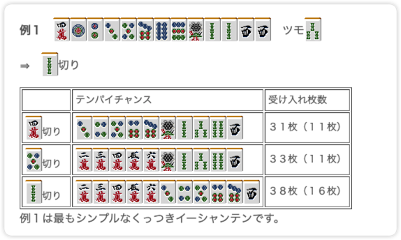
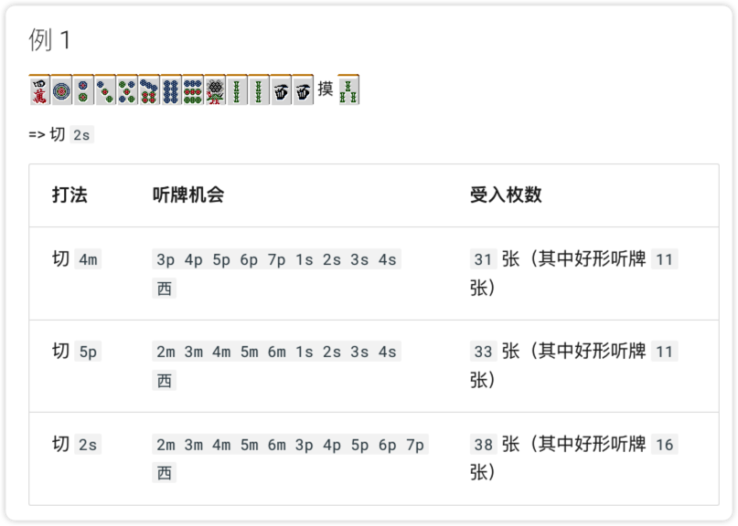

最近，我用 Codex 做了一个日麻入门网站：<https://simzhou.com/riichi_mahjong_book/>。
<!--more-->
源码仓库在这里：<https://github.com/SimZhou/riichi_mahjong_book>。

# 背景

起因是最近入坑了雀魂，结果发现自己老是给人点炮，于是一度想怒卸游戏（不是）。

后来还是决定认真补一补日麻技术（认真脸）。

于是我找到了一个在日本似乎比较知名的立直麻将教学网站：<http://beginners.biz/>

之前似乎曾被一个叫 79 的博客转载并翻译过，但那个网站后来似乎已经关闭了，所以我就想着自己再搭一个。

# 使用 Codex 搭建网站

用 Codex 做这件事，真的非常简单。它尤其擅长这种相对直接的前后端任务。

基本上只要一句话，就能把项目初始化起来：

```
请帮我根据http://beginners.biz/网页，做一个日麻教程手册网站。
```

# 一个重要的踩坑点

最初我用 Codex + GPT-5.4 来搭建时，直接让模型逐页翻译网页并生成对应页面。

网页的前后端本身没有问题，但翻译和排版效果却差强人意。

**不是这里丢了一张示意图，就是那里少了一些内容；有时还会擅自加入自己的理解，甚至出现翻译错误。**

**而且即便让模型自己抽查了好几次，这些问题也始终没有完全解决。**

下面是一个翻译后丢失了原始页面示意图的例子：


<div style="display:flex; flex-wrap:wrap; gap:1rem; align-items:flex-start; margin:1.5rem 0;">
  <figure style="flex:1 1 320px; margin:0;">
    <a href="Missing_figures--Original.png" data-lightgallery="item" title="原始网页，麻将牌的示意图">
      
    </a>
    <figcaption class="image-caption">原始网页，麻将牌的示意图</figcaption>
  </figure>
  <figure style="flex:1 1 320px; margin:0;">
    <a href="Missing_figures--Observed.png" data-lightgallery="item" title="翻译后网页，麻将牌示意图发生了丢失">
      
    </a>
    <figcaption class="image-caption">翻译后网页，麻将牌示意图发生了丢失</figcaption>
  </figure>
</div>


我当时就在想，翻译这件事对大模型来说，照理说几年前就不该算难题了。

尤其是像 GPT-5.4 这样当前最领先的模型之一，按理不该出现这么低级的错误。

**于是，我尝试创建了一个 Skill，一切突然就变得容易了起来。**

# 使用 Skill 后的效果

我使用 Codex 的 `$skill-creator` 创建了一个 Skill，大致告诉它：
 - 输入是原始日文的网页，输出为目标语言的网页
 - 尽量按照原来的含义翻译网页，不要加入自己的理解，也不能丢失内容
 - 不能丢失原文中的任何示意图
 - 不能改变网页的布局和样式，如果有表格等结构也要保留

结果，翻译后的网页无论在译文还是排版上都非常贴近原文，整体效果几乎没有明显问题。

以下是对比图（左边是最初生成的页面，中间是使用 Skill 后的结果，右边是原始日文页面）：





可以明显看出，修正后的页面已经比较接近原网页，内容和版式都保留得更完整。

内容长度也基本一致，不会明显偏多或偏少。

（最后优化后的 Skill 文件见：[translate-japanese-webpage/SKILL.md](https://github.com/SimZhou/riichi_mahjong_book/blob/main/.agents/skills/translate-japanese-webpage/SKILL.md)）

# 总结

对于这样的简单任务，Codex 目前已经能做得相当不错。

美中不足的是，全程我还是需要不停的给Codex敲回车。

后续可以探索一下多 Agent / SubAgent 的工作流，比如指派一个 Agent 负责内容监督，另一个 Agent 负责网页翻译和排版。

这样也许就能进一步解放双手，更接近让 AI 自动协作完成这类任务。
