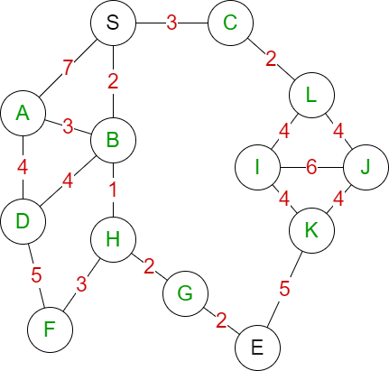

# Dijkstras Algorithm


例子：

假设我们有一张图，我们希望找到S到E的最优路径：



用邻接矩阵来定义这张图：

```python
# 顺序：S,A,B,C,D,E,F,G,H,I,J,K,L
adj = [
    [0,7,2,3,0,0,0,0,0,0,0,0,0],
    [7,0,3,0,4,0,0,0,0,0,0,0,0],
    [2,3,0,0,4,0,0,0,1,0,0,0,0],
    [3,0,0,0,0,0,0,0,0,0,0,0,2],
    [0,4,4,0,0,0,5,0,0,0,0,0,0],
    [0,0,0,0,0,0,0,2,0,0,0,5,0],
    [0,0,0,0,5,0,0,0,3,0,0,0,0],
    [0,0,0,0,0,2,0,0,2,0,0,0,0],
    [0,0,1,0,0,0,3,2,0,0,0,0,0],
    [0,0,0,0,0,0,0,0,0,0,6,4,4],
    [0,0,0,0,0,0,0,0,0,6,0,4,4],
    [0,0,0,0,0,5,0,0,0,4,4,0,0],
    [0,0,0,2,0,0,0,0,0,4,4,0,0]
]
```

用python转换为字典结构：

```python
graph = {
    "S": {"A": 7, "B": 2, "C": 3},
    "A": {"S": 7, "B": 3, "D": 4},
    "B": {"S": 2, "A": 3, "D": 4, "H":1},
    "C": {"S": 3, "L": 2},
    "D": {"A": 4, "B": 4, "F": 5},
    "E": {"G": 2, "K": 5},
    "F": {"D": 5, "H": 3},
    "G": {"E": 2, "H": 2},
    "H": {"B": 1, "F": 3, "G": 2},
    "I": {"J": 6, "K": 4, "L": 4},
    "J": {"I": 6, "K": 4, "L": 4},
    "K": {"E": 5, "I": 4, "J": 4},
    "L": {"C": 2, "I": 4, "J": 4}
}
```
然后我们求解从 S 到 所有点 的 Dijkstra最短路径：
```python
import heapq

def dijkstra(Graph, start):
    '''准备3样东西：pq, distance, visited；如果需要打印路径则还需一个path'''
    pq = []
    heapq.heappush(pq, (0, start))
    distance = {k: float('inf') for k in Graph}
    distance[start] = 0
    visited = set()
    path = {k:[start] for k in Graph}

    while pq:
        dis, node = heapq.heappop(pq)
        if node in visited: continue
        visited.add(node)
        for adjnode in Graph[node]:
            new_dis = distance[node] + Graph[node][adjnode]
            if new_dis < distance[adjnode] and adjnode not in visited:
                distance[adjnode] = new_dis
                heapq.heappush(pq, (new_dis, adjnode))
                path[adjnode] = path[node] + [adjnode]
    return distance, path
```

最终，我们可以得到，S 到 E 的最短路径为7，路径为 ['S', 'B', 'H', 'G', 'E']