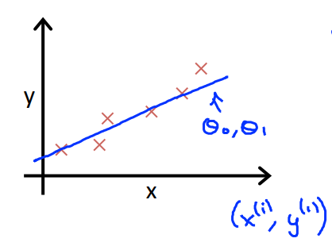
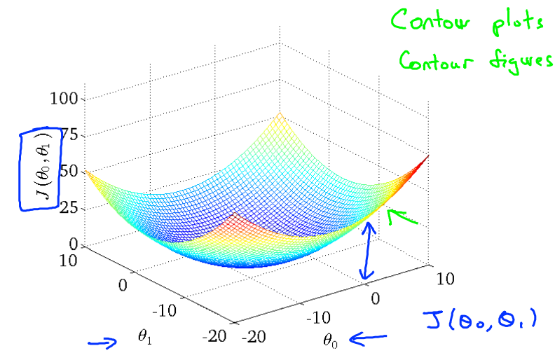
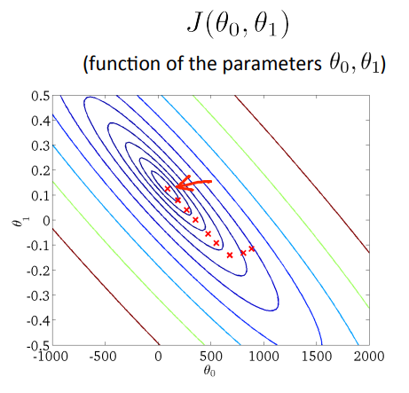

本内容按照吴恩达公开课《Machine Learning》的 Lecture Slides 进行分类，每一个H1标题对应一个Lecture Slide，每一个H2标题对应Lecture Slide中的一个小章节。

本内容是课程的简化总结，适合已经了解机器学习基本概念的人进行回顾以及查漏补缺。

# 2 一元线性回归

## 2.1 模型介绍

以房价预测举例，x为房屋面积，y为房价，那么通过训练数据来学习到的模型$h(x)=\theta_0+\theta_1\cdot{x}$（二维平面的一条线）就可以通过面积来预测房价。

## 2.2 损失函数

如何学习正确的$\theta_0$和$\theta_1$来确定这条线呢？我们希望这条线和样本数据约靠近越好。

## 2.3 损失函数理解 I

损失函数的目的是**最小化均方误差**：

$$
J(\theta)=\frac{1}{2m}\sum_{i=1}^{m}(h_{\theta}(x^{(i)})-y^{(i)})^2
$$
其中**m**为样本个数，$h_{\theta}(x)$为模型函数，x(i) y(i)分别对应样本点。

## 2.4 损失函数理解 II

**模型**：$h(x)=\theta_0+\theta_1\cdot{x}$

**参数**：$\theta_0$，$\theta_1$

**损失函数**：$J(\theta_0, \theta_1)=\frac{1}{2m}\sum_{i=1}^{m}(h_{\theta}(x^{(i)})-y^{(i)})^2$

**目标**：通过改变$\theta_0$，$\theta_1$来最小化$J(\theta_0, \theta_1)$

> 编者注：后来我们知道，最小化损失函数的过程就是一个凸优化问题

## 2.5 梯度下降

重复下面步骤，直到**收敛**：

$\theta_j := \theta_j - \alpha\frac{\part}{\part\theta_j}J(\theta_0,\theta_1)$

> **重点**：一定要一次性计算好所有方向上的梯度，然后一次性更新所有$\theta$参数。以下步骤是错误的：
>
> $temp0 := \theta_0 - \alpha\frac{\part}{\part\theta_0}J(\theta_0,\theta_1)$
>
> $\theta_0 := temp0$
>
> $temp1 := \theta_1 - \alpha\frac{\part}{\part\theta_1}J(\theta_0,\theta_1)$
>
> $\theta_1 := temp1$
>
> （此举会导致参数按每个梯度方向都更新一次）

$\alpha$：**学习率**。太小会导致学习太慢，太大会导致跳过最低点甚至损失函数发散

## 2.6 线性回归的梯度下降

**求导**可得：

$\frac{\part}{\part\theta_0}J(\theta_0,\theta_1)=\frac{1}{m}\sum_{i=1}^{m}(h_{\theta}({x^{(i)})}-y^{(i)})$

$\frac{\part}{\part\theta_1}J(\theta_0,\theta_1)=\frac{1}{m}\sum_{i=1}^{m}(h_{\theta}({x^{(i)})}-y^{(i)})\cdot{x^{(i)}}$

**批梯度下降**：对应损失函数中的m，批梯度下降使用所有的训练数据

**随机梯度下降**：一次训练不采用全部的训练数据（降低m），目的是减少计算量
