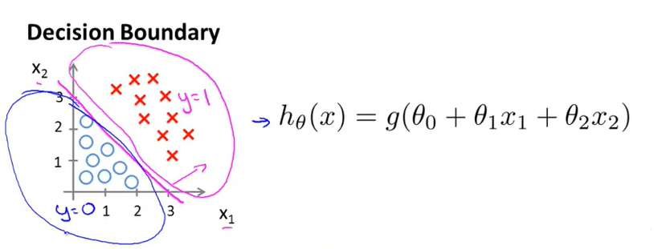
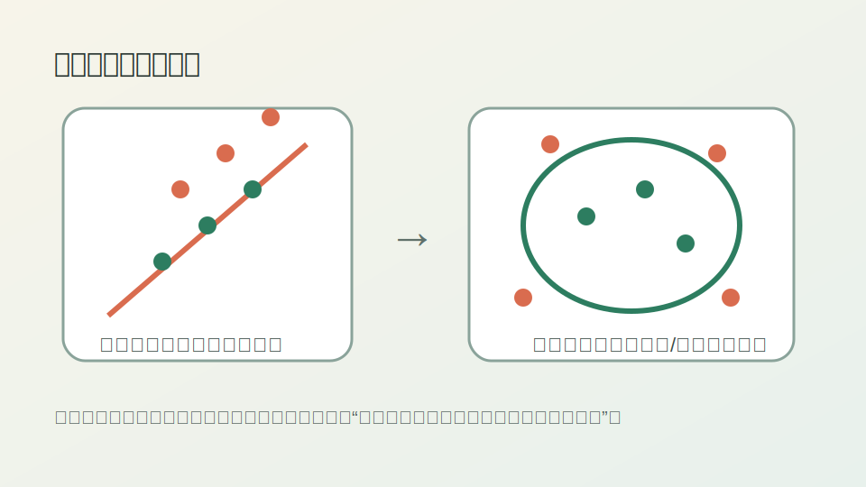
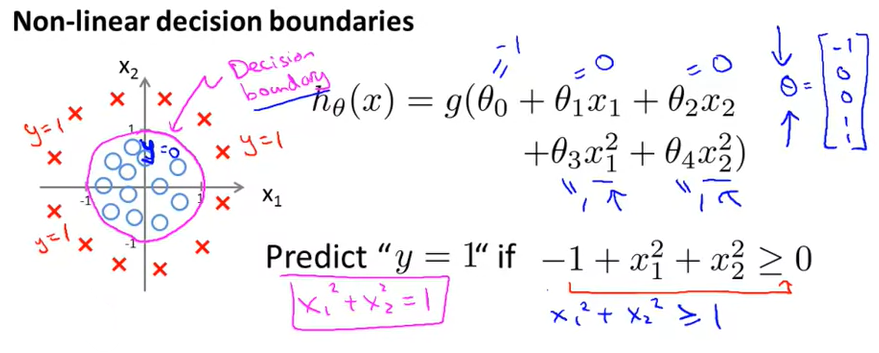
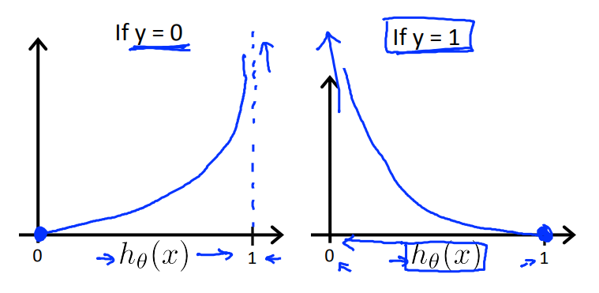

---
mathjax:
  presets: '\def\lr#1#2#3{\left#1#2\right#3}'
---
本内容按照吴恩达公开课《Machine Learning》的 Lecture Slides 进行分类，每一个H1标题对应一个Lecture Slide，每一个H2标题对应Lecture Slide中的一个小章节。

本内容是课程的简化总结，适合已经了解机器学习基本概念的人进行回顾以及查漏补缺。


# 6 逻辑回归

## 6.1 分类

逻辑回归用于**分类问题**的场景，例如：

- 邮件是否是垃圾邮件？
- 订单是否是欺诈订单？
- 肿瘤是良性还是恶性？

此时 $y\in\{0,1\}$，一般把0当作负例，1当作正例

**阈值的选择**：可以自定义，例如：

当 $h_{\theta}(x)\geq0.5$ 时，预测 $y=1$

当 $h_{\theta}(x)\lt0.5$ 时，预测 $y=0$

> 编者注1：后来我们知道阈值的选择会对应不同的模型表现，通过衡量模型在**不同阈值下的总体表现**，就产生了**ROC曲线**，通过计算ROC曲线下的面积，就产生了**AUC评价指标**。
>
> 编者注2：**为什么要使用逻辑回归呢？**通过线性函数拟合，然后选择恰当的阈值来得到结果不可以吗？可以，但是这样做有两个问题：一、阈值的选择会因此变得非常敏感；二、线性函数会因此无法很好地拟合数据。其实本质上来讲，使用sigmoid函数将连续空间转化到[0, 1]空间，就是为了更好地拟合数据分布的空间。
>
> 编者注3：进一步思考，如果采用线性模型，仅在损失的计算中应用sigmoid（例如logit loss），那么模型的拟合与逻辑回归其实是一样了，此时也可以通过选择一个恰当的y的阈值来定义模型。此时可以理解为把逻辑回归的sigmod层脱离了出来，这里的y就是逻辑回归中的隐藏层y（加sigmoid函数之前）

## 6.2 模型表示

在线性回归的基础上：增加一个函数 $g$，使得：

$h_{\theta}(x)=g(\theta^Tx)$

如果 $g$ 使用Sigmoid函数(也叫Logistic函数)，则模型就叫逻辑回归(Logistic Regression)

$g(z)=\frac{1}{1+e^{-z}}$

于是，整个模型就是 $h_{\theta}(x)=\frac{1}{1+e^{-\theta^Tx}}$

由于逻辑回归的输出为(0, 1)空间，所以可以解释为概率值，例：如果 $h_\theta{(x)}=0.7$ 则一个病人的肿瘤为恶性的概率为70%。

## 6.3 决策边界的线性与非线性

当输入g(z)的**模型函数为线性函数**时，**决策边界就是线性**的。例如，输入线性函数情况下定义决策边界为0.5，则当 $h_\theta{(x)}\geq0.5$ 时，$\theta^Tx$ 就 $\geq0$，此时 $\theta^Tx$ 就是二维平面内划分正负样例的一条直线：



当输入g(z)的**函数为非线性函数**时，**决策边界就可以是非线性**的。例如，当输入函数为$z{(x)}=\theta_0+\theta_1{x_1}+\theta_2{x_2}+\theta_3{x_1^2}+\theta_4{x_2^2}$ 时，函数为抛物面，



此时的**决策边界**就可以是一个**圆/椭圆**：



## 6.4 逻辑回归损失函数

逻辑回归的损失函数如下：

$Cost(h_\theta{(x)},y)=\begin{cases}-log(h_\theta(x))&if\;y=1\\-log(1-h_\theta(x))&if\;y=0\end{cases}$

其图像如下：



## 6.5 简化损失函数与梯度下降

**简化后的损失函数**为：

$J(\theta)=-\frac{1}{m}[\sum_{i=1}^{m}y^{(i)}\log{h_\theta{(x^{(i)})}}+(1-y^{(i)})\log{(1-h_\theta{(x^{(i)})})}]$

同时考虑了y=1和y=0的情况，并且把负号提到了最前面。

> 编者注：这个损失函数就叫做**Log损失**或者**Logistic损失**或者**Logit损失**或者**Logarithmic损失**，都是同一个东西。参考: [Reference](https://stats.stackexchange.com/a/224135/291675)

**逻辑回归的梯度下降**：

对$J(\theta)$求导，可得：$\frac{\partial}{\partial\theta_j}J(\theta)=\frac{1}{m}\sum_{i=1}^{m}(h_{\theta}({x^{(i)})}-y^{(i)})\cdot{x_{j}^{(i)}}$

因此如果要最小化 $J(\theta)$，算法为：

重复 $\theta_j:=\theta_j-\alpha\sum_{i=1}^{m}(h_{\theta}({x^{(i)})}-y^{(i)})\cdot{x_{j}^{(i)}}$ 直到**函数收敛**。

可以发现**这个表达式和最小二乘法的线性回归几乎一样**！

## 6.6 高级优化算法

除了梯度下降，还有一些更高级的优化算法，例如：

- 共轭梯度法 ([Conjugate Gradient](https://en.wikipedia.org/wiki/Conjugate_gradient_method))
- [BFGS](https://en.wikipedia.org/wiki/Broyden–Fletcher–Goldfarb–Shanno_algorithm)，属于拟牛顿法的一种，以四位数学家Broyden, Fletcher, Goldfarb, Shanno的首字母命名
- [L-BFGS](https://en.wikipedia.org/wiki/Limited-memory_BFGS)，即Limited BFGS，是在有限内存中求BFGS的一种方法

这些方法**无需设定学习率**，一般**比梯度下降更快**，但缺点是**计算复杂度更高**

在Octave中可以用fminunc函数来使用这些优化算法：

```octave
options = optimset('GradObj', 'on', 'MaxIter', 100);
initialTheta = zeros(2,1);
   [optTheta, functionVal, exitFlag] = fminunc(@costFunction, initialTheta, options);
```

## 6.7 多分类：一对多

对于多分类问题（大于等于3个类别），可以采用一对多方式，对每个类别都训练一个二分类模型（把当前类为1当作正类），然后在预测时把样本输入到每个模型中，最后选择的类别为最大的输出概率所对应的类别：$\underset{i}{\operatorname{argmax}}h_\theta^{(i)}(x)$
