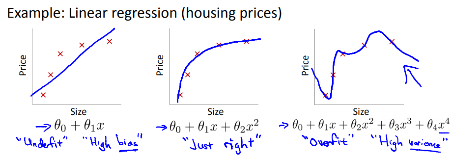
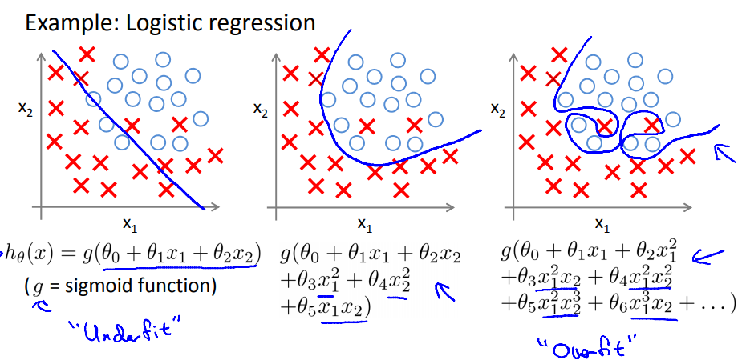

本内容按照吴恩达公开课《Machine Learning》的 Lecture Slides 进行分类，每一个H1标题对应一个Lecture Slide，每一个H2标题对应Lecture Slide中的一个小章节。

本内容是课程的简化总结，适合已经了解机器学习基本概念的人进行回顾以及查漏补缺。

# 7 正则化

## 7.1 过拟合问题

**过拟合**：如果特征过多，模型可能对训练集有很好的效果，但泛化能力很差

线性回归例子：

逻辑回归例子：

**解决过拟合**的方法：

1. **减少特征数量**
   - 手工选取重要特征
   - 特征选择算法（后面会介绍）
2. **正则化**
   - 保留所有特征，但是对参数 $\theta_j$ 的量级加以限制
   - 当所有特征都对模型有一点点贡献的情况下，正则化很有效

## 7.2 带正则化项的损失函数

带L2正则化项的损失函数为：
$$
J(\theta)=\frac{1}{2m}[\sum_{i=1}^{m}(h_{\theta}(x^{(i)})-y^{(i)})^2+\lambda\sum_{j=1}^{n}\theta_j^2]
$$

其中的正则化项 $\lambda\sum_{j=1}^{n}\theta_j^2$ 限制了 $\theta$ 的增长，$\lambda$ 为正则化系数。

如果 $\lambda$ 选择过大，会导致模型欠拟合。

## 7.3 带正则化的线性回归

**带正则化的梯度下降**：

此时的梯度要同时考虑正则化项

$\frac{\part}{\part\theta_0}J(\theta)=\frac{1}{m}\sum_{i=1}^{m}(h_{\theta}({x^{(i)})}-y^{(i)})\cdot{x_0^{(i)}}$

$\frac{\part}{\part\theta_j}J(\theta)=\frac{1}{m}\sum_{i=1}^{m}(h_{\theta}({x^{(i)})}-y^{(i)})\cdot{x_j^{(i)}}+\frac{\lambda}{m}\theta_j$

梯度更新方程对于 $\theta_0$ 是不变的，对于 $\theta_j$ 就变成了：

$\theta_j:=\theta_j(1-\alpha\frac{\lambda}{m})-\frac{1}{m}\sum_{i=1}^{m}(h_{\theta}({x^{(i)})}-y^{(i)})\cdot{x_j^{(i)}}$

可以看到L2正则化相当于给 $\theta_j$ 的梯度更新方程增加了一个惩罚项，每次更新参数时都会对 $\theta_j$ 进行一部分缩减，并且这个缩减量与三个系数相关。

**带正则化的标准方程**：

带正则化的标准方程为：

$\theta=(X^TX+\lambda\begin{bmatrix}0&0&0&...&0\\0&1&0&...&0\\0&0&1&...&0\\\vdots&\vdots&\vdots&\ddots&\vdots\\0&0&0&...&1\end{bmatrix})^{-1}X^Ty$

这个里面的矩阵是一个左上角元素为0的单位矩阵，维度为 (n+1)x(n+1)，n为特征个数

之前说过当 样本个数 m<n 时，$X^TX$ 不可逆，但是这里当我们**加入后面这项后**，这个整个东西 $X^TX+\lambda\cdot{L}$ 就**可逆**了。

## 7.4 带正则化的逻辑回归

此时的Log损失函数变为：

$J(\theta)=-\frac{1}{m}[\sum_{i=1}^{m}y^{(i)}\log{h_\theta{(x^{(i)})}}+(1-y^{(i)})\log{(1-h_\theta{(x^{(i)})})}]+\frac{\lambda}{2m}\sum_{j=1}^{n}{\theta_j^2}$

梯度下降算法过程变为：

$\theta_0:=\theta_0-\alpha\frac{1}{m}\sum_{i=1}^{m}(h_{\theta}({x^{(i)})}-y^{(i)})\cdot{x_{0}^{(i)}}$

$\theta_j:=\theta_j-\alpha[\frac{1}{m}\sum_{i=1}^{m}(h_{\theta}({x^{(i)})}-y^{(i)})\cdot{x_{j}^{(i)}}+\frac{\lambda}{m}\theta_j]$
